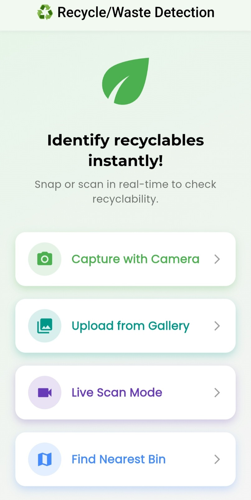
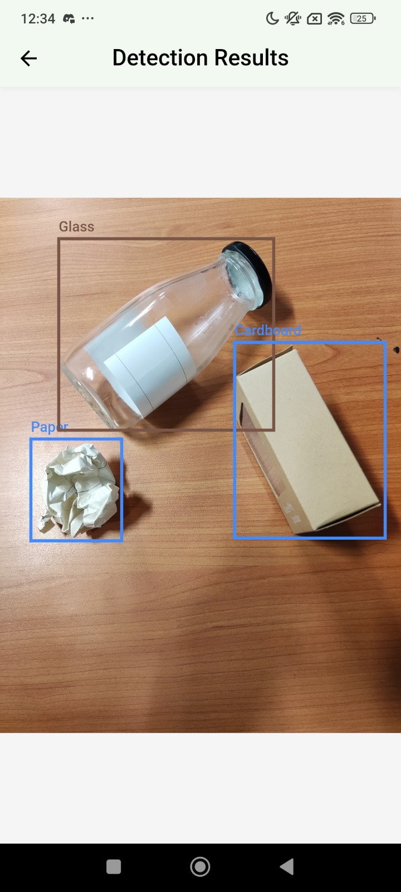
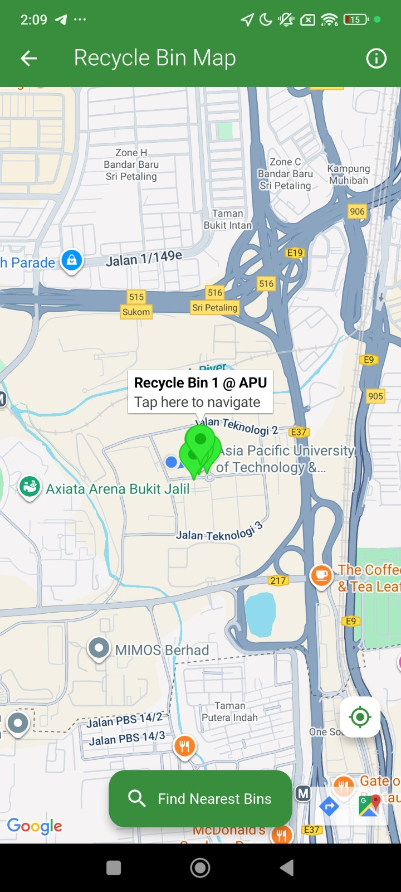

<<<<<<< HEAD
# recycledetectionapp

A new Flutter project.

## Getting Started

This project is a starting point for a Flutter application.

A few resources to get you started if this is your first Flutter project:

- [Lab: Write your first Flutter app](https://docs.flutter.dev/get-started/codelab)
- [Cookbook: Useful Flutter samples](https://docs.flutter.dev/cookbook)

For help getting started with Flutter development, view the
[online documentation](https://docs.flutter.dev/), which offers tutorials,
samples, guidance on mobile development, and a full API reference.

---
# ♻️ EcoVision Recycle Detection App

A Flutter-based mobile application that uses AI-powered object detection to classify **recyclable item** in real-time.  
The app also features a **Recycle Bin Navigator** that helps users locate the nearest recycling bin, promoting smarter and greener waste disposal.  

---

## 🚀 Features
- 📸 **Real-time camera detection** – detect waste items on the spot  
- 🖼️ **Image upload detection** – analyze saved images for classification  
- 🗺️ **Recycle Bin Navigator** – fetches bin locations from **AWS DynamoDB** and displays them in-app  
- 📍 **Nearest bin recommendation** – automatically sorts and shows closest recycling bin to the user  
- 🔔 **User-friendly interface** – clean and intuitive design  
- 🌱 **Supports sustainability** – encourages recycling through awareness  

---

## 🛠️ Tech Stack
- [Flutter](https://flutter.dev/) – Cross-platform mobile development  
- [Dart](https://dart.dev/) – Programming language  
- [YOLO] – AI model for waste detection  
- [AWS DynamoDB](https://aws.amazon.com/dynamodb/) – Stores recycling bin locations  
- [Google Maps API / Flutter Maps] – Displays bin locations on a map  
- [Android] – Target platforms  

## 🌱 Vision

By leveraging **AI, AWS, and mobile technology**, this app empowers individuals and communities to take **small but impactful steps toward sustainability**.  

---

## 📦 Installation & Setup

1. Clone the repository:
   ```bash
   git clone https://github.com/your-username/recycle-detection-app.git
   cd recycle-detection-app
   ```
2. Get dependencie
   ```bash
   flutter pub get
   ```
3. Run the app in debug mode:
   ```bash
   flutter run
   ```
## 📲 Build APK
For release APK (sideload/testing):
```bash
flutter build apk --release
```
Output file:
```swift
build/app/outputs/flutter-apk/app-release.apk
```
For Play Store App Bundle (AAB):
```bash
flutter build appbundle --release
```
## 📷 Screenshots

### Home Page


### Waste Detection


### Recycle Bin Navigator


## 📝 License
This project is licensed under the MIT License
>>>>>>> b260a62883f7de36ba1637daced14151357c49d7
